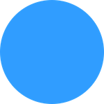
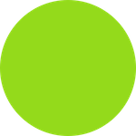
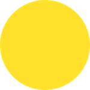

## Artwork
The artwork for our game will be very simple. We can use colored `Node` objects to act as __Layers__ and simple squares and circles to represent the __germs__ and __pill halves__ in the original __Dr. Mario__ game.

For simplicity purposes we can use a simple colored circle to represent the __germs__. Four colors seems like enough. Example:

   
   

We can also use a simple colored square to represent the __pills__. Example:

   
   

This will take many color combinations. Since we can rotate pieces we don't need quite as many conbinations as you might think. Take a look at the following table:

. | __Red__ | __Blue__ | __Yellow__ | __Green__
--- | --- | --- | --- | ---
__Red__ | __y__ | __y__ | __y__ | __y__
__Blue__ | x | __y__ | __y__ | __y__
__Yellow__ | x | x | __y__ | __y__
__Green__ | x | x | x | __y__

We don't need a designer or artist to do this for us! We can code right? Let's combine the 2 squares programatically. We will go through this step further on in this tutorial.

With our art in hand, let's get started on the good stuff. Laying out our game and writing some code.

Let's move on to creating a new [Cocos Creator project](creating_a_cocos_creator_project.md)...