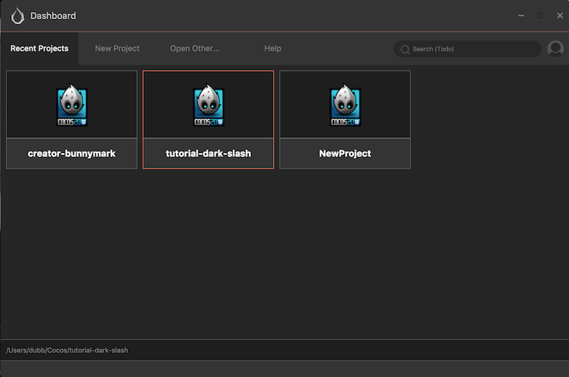
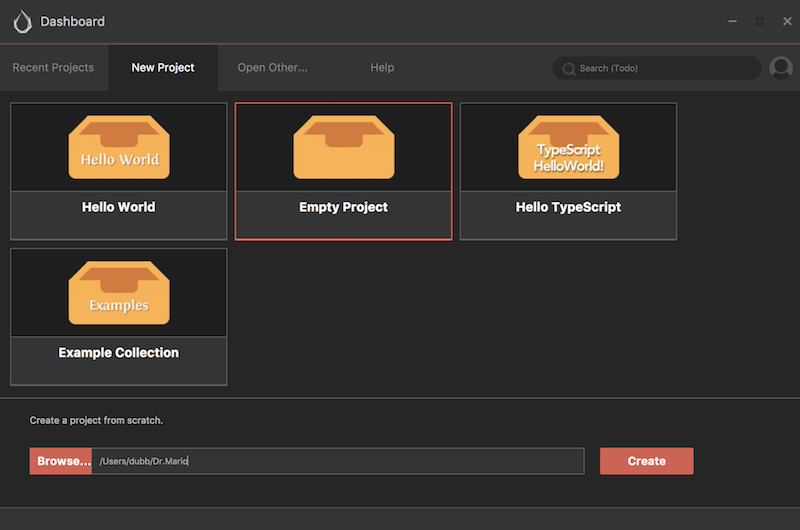
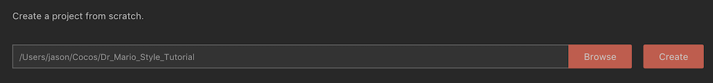
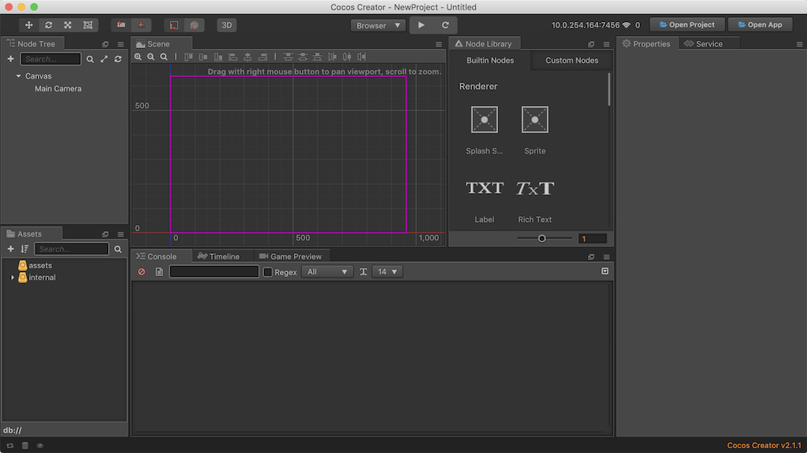

## Creating a new Cocos Creator project
The [Cocos Creator Documentation](http://www.cocos2d-x.org/docs/creator/en/getting-started/hello-world.html) has official instructions for creating a new project. Please refer to it for any specific questions you may have. For the purpose of this game just the basic steps will be shown.

* Launch __Cocos Creator__. You will be given a window that shows you and __recent__ projects you have worked on. It looks like this:

    

* Change to a __new project__ by clicking on the __New Project__ tab. We want to start a brand new game. Select an __Empty Project__.

    

* Give your project the name __Dr-Mario-Style-Tutorial__ and choose a location on your filesystem that best suits you. Click __Create__.

    

* __Cocos Creator__ will create your new project and put you in a window that looks like this:

    

__Task:__ Now is a good time to save your project! From the __File__ menu, select __Save Scene__ or use your operating system's shortcut key.

We can now move on to [the ending of this chapter](end.md)...