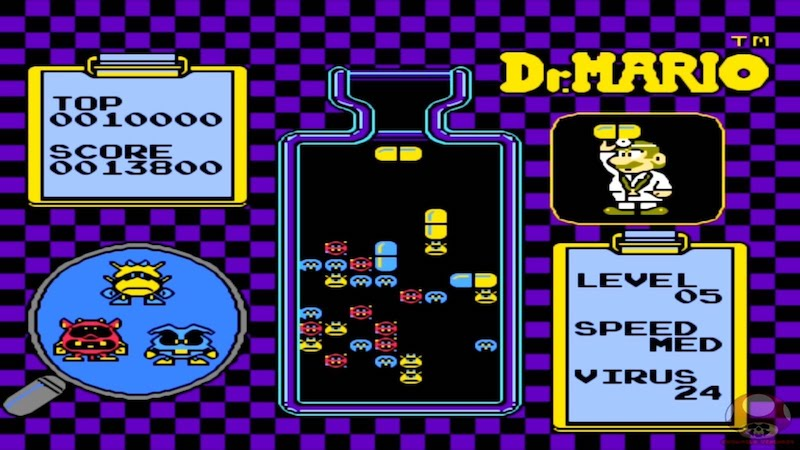
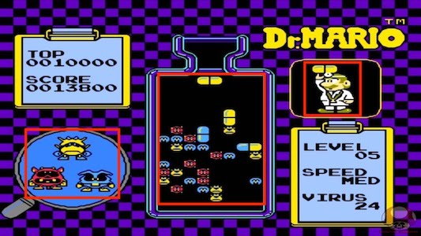

## Designing the game
Let us take a look at a simple Dr. Mario level and break it down into pieces.

An initial glance reveals that we need some common items found in most every game. What are they?

  * `Sprite` objects for the germs, pills, other graphics

  

  * `Label` objects for score, statistics, etc

  

  * A way to detect collisions and act upon them

  * A way to create the game board and decide what pieces to serve the player

  * Let the player customize their game play experience
