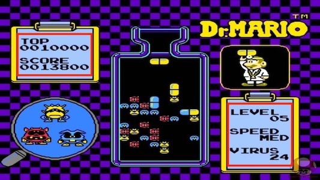

## Designing the game
Let us take a look at a simple Dr. Mario level and break it down into pieces.

An initial glance reveals that we need some common items found in most every game. What are they?

  * `Sprite` objects for the germs, pills, other graphics

    

  * `Label` objects for score, statistics, etc

    

  * A way to detect collisions and act upon them

  * A way to create the game board and decide what pieces to serve the player

  * Let the player customize their game play experience

Other developers have paid tribute to Dr. Mario and written their own clones. Here is an example that demonstrates how the UI is easy to break down into its elements:

  

This idea is simple but demonstrates exactly what we need to do. Let's use it as inspiration for our design. A special __thank you__ to the author of this clone if they ever read this tutorial!

Next, we will need some [art work](artwork.md)...