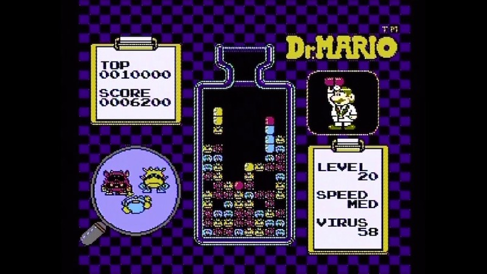

## What is Dr. Mario like?
Let's take a look at a typical game play scene:

What is actually going on here? Can you already tell how to play the game? Let's talk a bit about how to play the game:

  * Each level starts with __germs__ in the __bottle__.
  * __Pills__ fall one at a time from the top of the screen.
  * The player rotates the __pill__ to match the color of a __germ__.
  * When there are __3__ vertically stacked __pills__ that match the __germ__ color, the __germ__ gets destroyed and disppears from the __bottle__.
  * Clear all the __germs__ and you move on to the next, harder level.
  * Making a wrong move is costly! __Pills__ will stack up and prevent you from clearing the __bottle__ easily.

    

    __Doesn't that look like a challenge?__

Now that we know how to play, we should discuss how to design the game.
