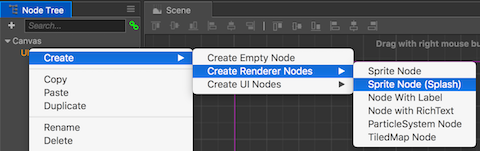
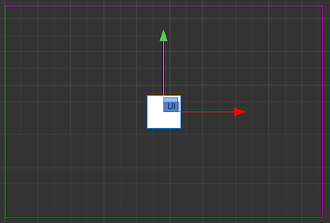
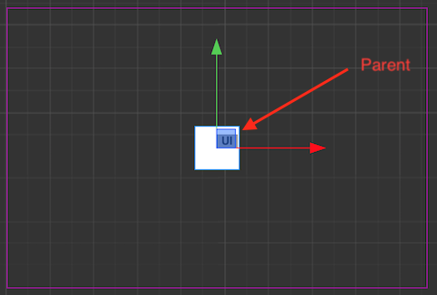
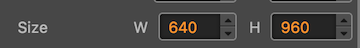
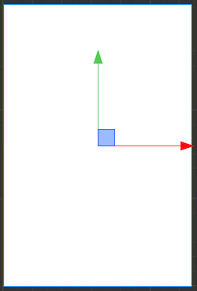

## Setting a colored background
Unless you want a black background, the first step is to start building up the UI simulating a "layered" look. You might remember `Layer` objects from __Cocos2d-x__. However, in __Cocos Creator__ `Layer` objects do not exist. Instead you can use a `Node` and set some __properties__ to achieve the same concept as you could before with a `Layer` object.

### Creating a background layer
*  In the __Node tree__ panel, __Right click__ on __UI__ node and select: __Create --> Create Renderer Nodes --> Sprite Node (Splash)__.

    

* You should see a small white colored `Node` appear on the `Scene`. Example:

    

  __Cocos Creator__ informs us of the  newly created `Node` objects parent, in this case the `Node` named __UI__ that we created above.

    

* Last, __Right click__ on __New Sprite(Splash)__ and rename it to __Background__.

### Customizing our background layer
Now that we have our `Node` we need to assign it a color and a size. Typically, a background layer might take up the entire `Canvas`. Let's adjust the __Background__ node's properties to do exactly this.

* First, select the __Background__ node from the __Node Tree__ panel.

* Second, in the __Properties__ panel, set the __color__ to anything you like. I am going to choose __white__ for simplicity as this is already the default.

* Third, in the __Properties__ panel, set the __size__ and __position__ of our __Background__ node. We want it to take up the entire canvas, so this this should be set to the same size as the __design resolution__ or in this case __640 x 960__. Also, the __position__ should be set to __0, 0__ so the node starts at the bottom left corner of the canvas.

      

* Last, double check to make sure what you have matches our progress so far.

    

__Task:__ Now is a good time to save your project! From the __File__ menu, select __Save Scene__ or use your operating system's shortcut key.
