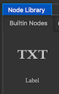
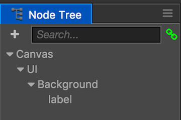
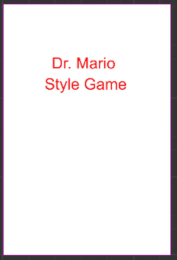

## Adding a game title
Now that we have a background, created in the previous step, we need to add items to it to make it look more like a menu screen. Let's add a game title. To do this we will be using the __Label__ node from the __Node Library__ panel.

  

* First, from the __Node Library__ panel, drag and drop a __Label__  on to the __Background__ node in the __Node Tree__ panel.

    

* Second, rename the label to __Title__ in the __Node Tree__ panel.

* Third, with __Title__ selected, change some properites for the label. This should include __color__, __label string__, __font__, __font size__, etc. Make it look how you wish. I ended up with:

    

__Task:__ Now is a good time to save your project! From the __File__ menu, select __Save Scene__ or use your operating systems shortcut key.
