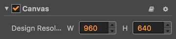
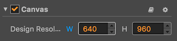
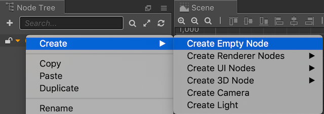
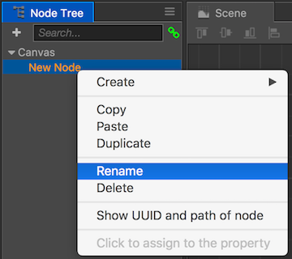
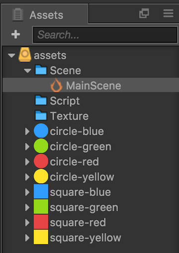
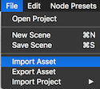

## UI housekeeping.
We need to do a few tasks to get started laying out our user interface. These items include choosing a __design resolution__ and adding any __Sprites__ that we need to our __Cocos Creator__ project.

### Setting the design resolution
One really important task is to decide on a __design resolution__ for our game. This is going to be a __portrait__ oriented game so the pieces have enough time to fall from the top of the screen. Using __landscape__ might not give the player enough time to react. Let's stick with the __960 x 640__ design resolution. You can tell what the design resolution is by looking at the properties of the __Canvas__ object:

  

* However, since we want this game __portrait__ we need to swap the width and height with each other. Our height needs to be the biggest number.

    

* Next, in the __Node tree__ panel, __right click__ on __Canvas__ node and select: __Create --> Create Empty Node__. This will create an __empty node__ to hold our user interface items.

    

* Last, __right click__ on the newly created `Node` and rename it to __UI__.

    

### Adding Sprites
__Sprites__ are of course going to be used in out game. Let's get them added right from the start. We will use them in several places so if you can do this up front is always a good. You can add __Sprites__ in one of two ways.

* The first, drag and drop from your file-system into the __Assets__ panel.

    

* The second, from the __Cocos Creator__ menubar, select __File --> Import Asset__.

    

__Task:__ Now is a good time to save your project! From the __File__ menu, select __Save Scene__ or use your operating systems shortcut key.
