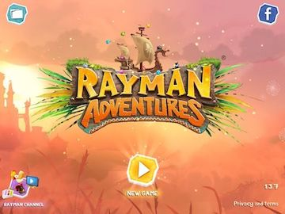
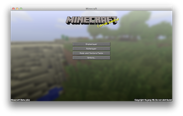
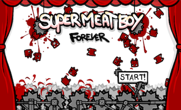
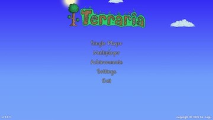

## Creating a menu screen
When you start to play a game the first thing you notice is a __menu screen__. This is usually a screen that has the games title, perhaps who made it, colorful graphics, possibily music and most importantly a __play button__. Pressing the __play button__ usually starts the game playing.

Take a look at these popular games and what their menu screens look like:

  
  

After looking at these examples, let's make a menu screen of our own.

### Table of contents
- [Creating a scene](menu_scene.md)
- [Setting a colored background](background.md)
- 
