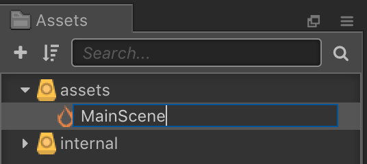
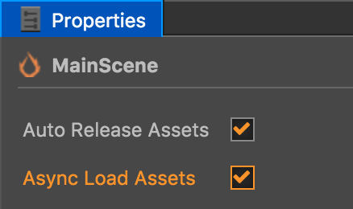

## Creating a scene
Before we can do anything we need a `Scene` object to hold everything. Our first sene will take care of introducing the player to out game and allowing them to start the game by pressing __play__.  As previously mentioned this `Scene` will have a background, text music and a __play__ button so the player can start the game.

To create a `Scene`:

* Right click on __Scene__ in the __Assets panel__ and select __Create__ and then __Scene__.

    

* Name the __Scene__ to __MainScene__ (notice no spaces!)

    

* Double click on the __MainScene__ to open it.

* In the __Properties panel__ for the `Scene` make sure to select the checkboxes for __Auto Release Assets__ and __Async Load Assets__.

    

With these steps done, we can now start working with our new `Scene`. __Double click__ on the __MainScene__ and lets move on to laying out our user interface!

__Task:__ Now is a good time to save your project! From the __File__ menu, select __Save Scene__ or use your operating systems shortcut key.
