## Creating a play button
In the previous steps, we created a background, a game title and added some Sprites to make it look more interesting. Next, we need to add a button. When the button is pressed, we need to load the `Scene` object that holds the logiv for our game.

### Adding a Play button
Adding a button, or adding *button like* functionality can be done in several ways. You can use a __Button__ node from the __Node Library__ panel. You can use a `Sprite` and make it act like button. Both are fine ways to achieve our goal. For this example, let's use a __Button__ node from the __Node Library__ panel.

  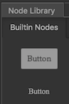

* First, from the __Node Library__ panel, drag and drop a __Button__  on to the __Background__ node in the __Node Tree__ panel.

    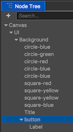

* Second, rename the label to __Play__ in the __Node Tree__ panel.

* Third, change the __Label__ of the __Play__ button to __Start Game__.

    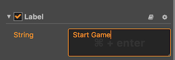

* Last, with __Play__ selected, change some properites for the button. This should include __position__, __size__, __color__, etc. Make it look how you wish. I stuck with the default properties for the purpose of this demo.

    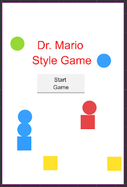

### Making the Play button work
Now that we have a button, we need to make it run code when we click it.

* First, select the __Play__ button so that some properties can be added. Scroll down in the __Properties__ panel until you see this:

    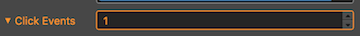

* Second, use the editor to add a __click event__:

    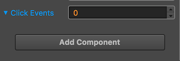

* Third, create a new Javascript file called __MenuScreen.js__. This is where any code we need for this `Scene` will go. We will add our __Play__ buttons logic here. You can do this by right clicking on the __Script__ folder in the __Assets Panel__ and selecting __Create --> Javascript__.

    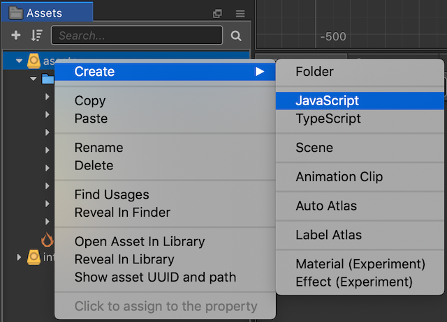 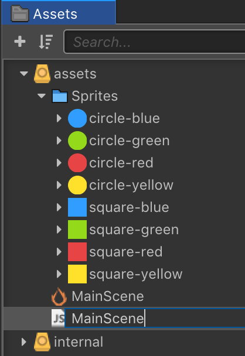

* Fourth, click the __Add Component__ button and select __Add Custom Component__ so we can add the newly created __MainScene.js__ as a component of our __Play__ button.

    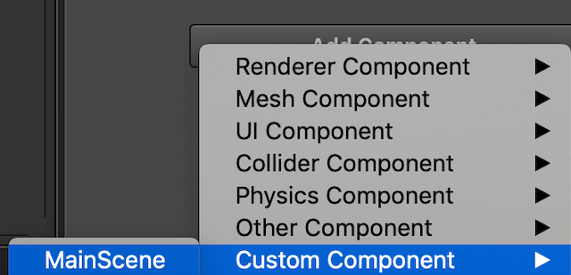

* Fifth, we need to add a __callback__ to the __MainScene.js__ so that we specify what code is to be run when the __Play__ button is clicked. Double clicking on the __MainScene.js__ will open it in the default external text editor specified by your operating system. Add the following __callback__:

  ```JavaScript
  callback: function (event) {
    	console.log("starting game...");    
  }
  ```

  We end up with a a Javascript file that looks like:

  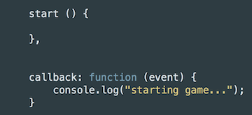

* Next, we need to tell the editor that when our __Play__ button is clicked we need to run a certain chunk of Javascript code. This is easily done by dragging a reference to the button to the properties dialog. Then you select the __MainScene.js__ file and the function you want to run. In our case we called it __callback:__. Selecting a better name when your needs get complex is probably a good idea. Example:

    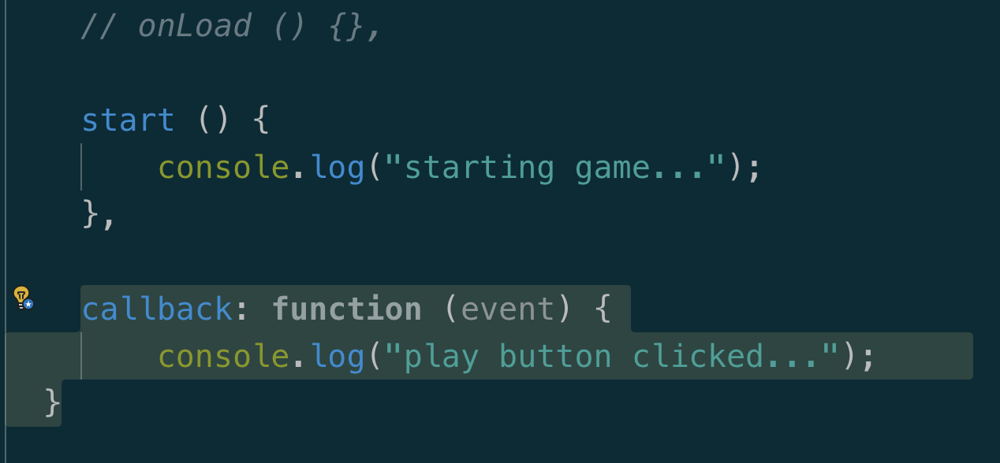

* Last, your __Properties__ panel should look like this when completed:

    

When we run our game and click out button we should see that it works:

  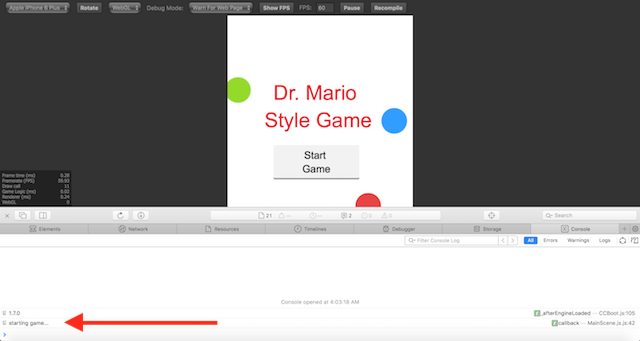

We will come back and add more code to this button later. For now, our button works when pressed. Let's move on to creating our main game scene, where the bulk of our game play will take place.  

__Task:__ Now is a good time to save your project! From the __File__ menu, select __Save Scene__ or use your operating system's shortcut key.
