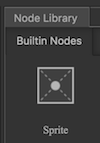
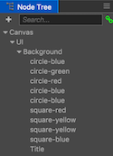
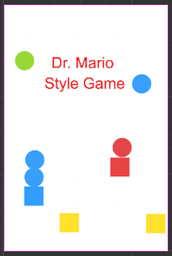

## Adding a few graphics
Besides a __Title__, created in the previous step, we should add a few __Sprites__ to jazz it up. Why don't we add a few of our squares and circles that will take the place of the germs and pills in the original Dr. Mario game. To do this we will be using the __Sprite__ node from the __Node Library__ panel.

  

The layout of these can be up to you. Just drag and drop from the __Assets__ panel on to the __Background__ node. You will end up with some variation of:

  

  

__Task:__ Now is a good time to save your project! From the __File__ menu, select __Save Scene__ or use your operating system's shortcut key.

Lastly for this chapter, we should [add a button](play_button.md) to start playing our game...