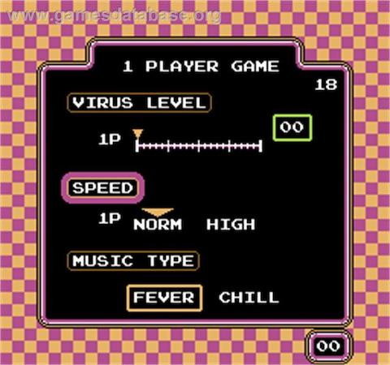

## Creating a menu screen
Now that our game starts and we are ready to play why not allow the player to select a few options of how they play the game, before it starts. Recall, that the opriginal Dr. Mario also allowed this:

Our game should have at least a few settings to offer the player some variety when they play.
We can draw on what we have read so far to make this next scene very quickly.

Shall we create our [game options scene](options_scene.md)?