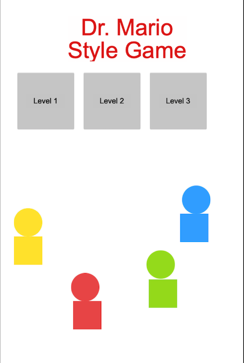
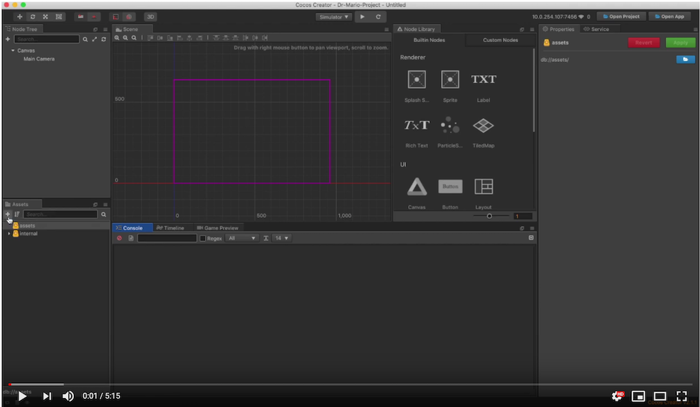

## Letting the players choose some options
We can always expand later, but for now, let's create a few settings to control which level they start with and also the speed of how fast the pieces will fall when playing.

We can layout the scene quickly to perhaps look something like this:

Call it __OptionsScene__.

Do you remember how to do everything needed to make this scene? Here are some hints:

  * Make a new scene in the __Assets panel__ (called __OptionsScene__).
  * Add a title? (optional)
  * Add 3 buttons, one for each level, call them __level1, level2, level3__.
  * Add 3 callbacks, one for each button, call them __level1, level2, level3__.
  
__Help:__ If you haven't made it this far or are stuck, you can download a completed project to this point [here](../../Dr-Mario-Style-Tutorial_ch4-part1.zip).

Once you are at this stage we can do a few things to make this start to feel like a real game. We can make a __Scene__ change from `MainScene` to `OptionsScene` when the game starts up.  

Up next, a [Scene calling another Scene](scene_calling_scene.md)