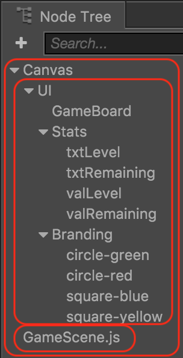

## Starting to code!
Now that we have our user interface laid out, we can start coding. Right from the start, there are some initial coding tasks to handle.

### How to start playing the game
Remember our __Main Scene__?

  

We need to make the __Play__ button work! How do we do that? Remember that we have all the code logic for __Main Scene__ scene in __MainScene.js__. To make the __Play__ button work we just need a single line of code added to our __callback__ function, modified to be:

```js
callback: function (event) {
    	cc.director.loadScene('GameScene');   
}
```

Notice that we added a line of code: `cc.director.loadScene('GameScene');`. This line simple says to load our __GameScene__.  Running this change in a browser shows what happens.

 __is replaced with__  

### Starting with core game logic
When the __Game Scene__ loads we need to have many things happen to make our game playable. We need to load a game board, load a sequence of peices that the player will use to solve the puzzle, start some music and more. To get started create __GameScene.js__ in the __Assets Panel__ and drag it directly into the __Node Tree__. Example:

  

Doing this will allow __GameScene.js__ to load and run on __Game Scene__ startup. This is exactly what we need to get our game to take shape and start being playable.

Now, let's move on to writing the core logic of the game.

__Task:__ Now is a good time to save your project! From the __File__ menu, select __Save Scene__ or use your operating systems shortcut key.
