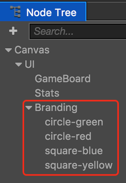
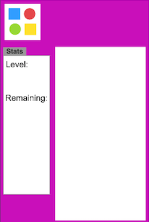

## Creating more of the game play interface.
We need to create the rest of our game play interface. The goal here is to make this look like the game we planned at the beginning. Remember this picture:

  

We need to create more aspects of this to build up our game. Once we have the user interface elements laid out we can start to build logic and add code.

* First, create another __Sprite Node (Splash)__ and call it __GameBoard__. Give it an __anchor point__ of __0.5 x 0.5__, __size__ of __490 x 750__ and a __position__ of __111 x -98__. This will act as the area where the game play happens.

* Second, let's add some place holders for statistics, like __level__, __counts__, etc. To do this, lets create another __Sprite Node (Splash)__ as a __child__ of our __UI__ node and call it __Stats__. Give it an __anchor point__ of __0.5 x 0.5__, __size__ of __200 x 600__ and a __position__ of __-208 x -61__.

* Third, let's repeat the same concept as the above steps and make a third place holder to hold some sort of branding, possibly a logo or text. To do this, lets create another __Sprite Node (Splash)__ as a __child__ of our __UI__ node and call it __Branding__. Give it an __anchor point__ of __0.5 x 0.5__, __size__ of __155 x 155__ and a __position__ of __-225 x 385__. The `Scene` should look like the following:

    

* Next, we can toss a few __Sprites__ up in the __Branding__ node. Just drag and drop them on to __Branding__ node in the__Node Tree__ panel.

    

* Fifth, adjust the __postion__ and __size__ of each __Sprite__ to achieve the look you wish. Example:

    

* Sixth, we can add a few __Labels__ to show statistics about the game. For now we can just add __Level:__ and __Remaining:__ labels. You do this the same was using the __Node Library__ panel. Adjust the __color__, __string__, __position__, __szie__, etc of each to look how you wish. You will need two labels, one is the text and the second is the value we will show the user for each about their progress. The only requirement here is name your labels: __txtLevel__, __txtRemaining__, __valLevel__ and __valRemaining__.

Design this how you wish. Your __Node Tree__ should look like this:

  

Your UI could look look something like this example:

  

__Task:__ Now is a good time to save your project! From the __File__ menu, select __Save Scene__ or use your operating system's shortcut key.

We can finally start [adding code](starting_to_code.md)....