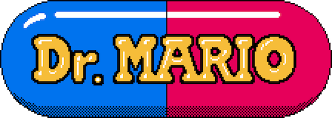

 [****](#f1)

## Making a Dr. Mario style game in Cocos Creator
Dr. Mario was published by Nintendo in the early 1990's. It turned out to be one of the most popular games of all time. In case you are not familiar you can watch some [game play](https://www.youtube.com/watch?v=iRLkhlXZsCc). For a history lesson check out [Wikipedia](https://en.wikipedia.org/wiki/Dr._Mario) and this [article](http://dreamandfriends.com/2012/10/26/virus-dr-mario-prototype/) about how the game was prototpyed.

You can download the complete [game](), however it is recommended that you follow this tutorial step by step for maximum understanding.

### Table of contents
The following topics are covered:

- [Getting started](01-getting-started/index.md)
- [Starting development](02-starting-development/index.md)

<b id="f1">****</b> __Nintendo__ owns Dr. Mario, the name, the logo, the art, the music, etc. We are just fans that wanted to make a kick-ass demo to demo __Cocos Creator__.[↩](#a1)
